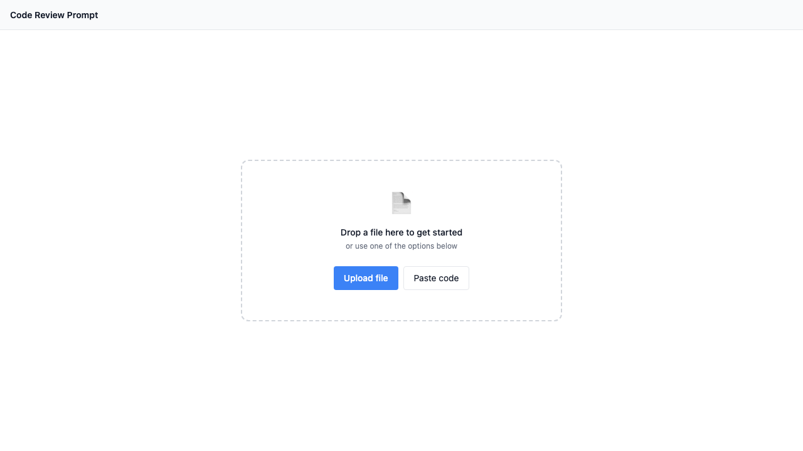
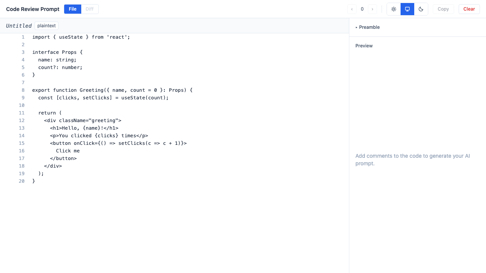
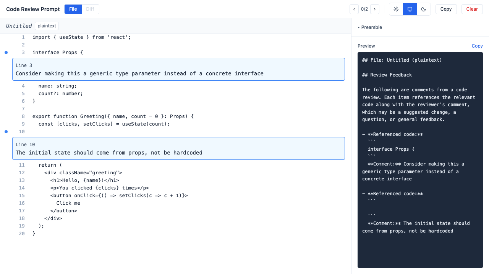
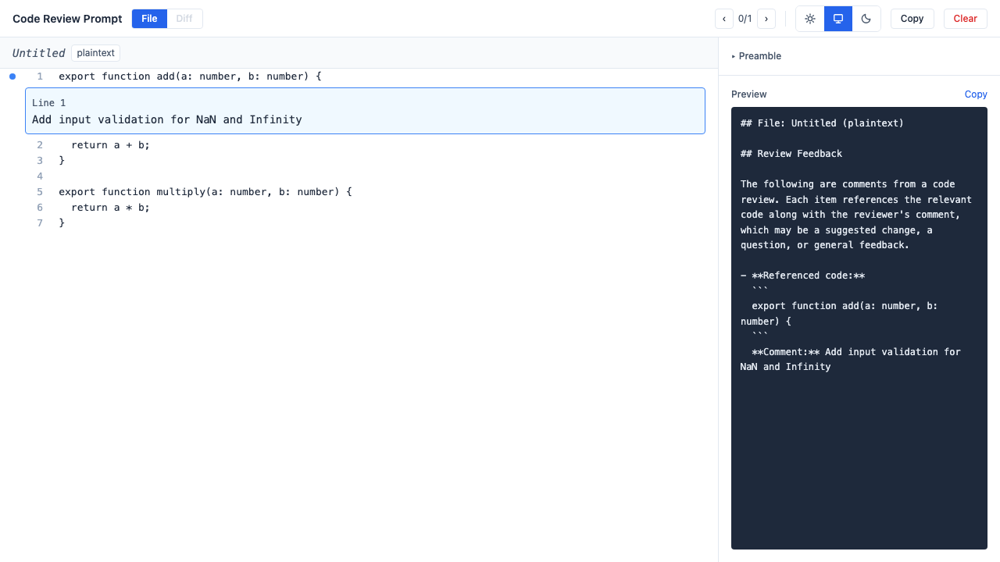

# Shepherd

A multi-agent coordination framework for building software through structured, spec-driven development. Markdown specs are the source of truth; code is derived from them.

## Demo

### Empty State



### File Loaded



### With Comments



### Prompt Generated



## What It Does

**Shepherd** orchestrates work across four functional areas — Product, Design, Engineering, and QA — using slug-based requirement IDs and a traceability index that maps every requirement to its design spec, implementation, and test cases.

The first app built with Shepherd is the **Code Review Prompt Generator (CRPG)**, a client-side web app that lets you annotate source code with inline comments and generate structured prompts for AI code review.

### CRPG Features

- **File loading** — Paste, upload, or drag-and-drop source files
- **Syntax highlighting** — c, cpp, css, go, html, java, javascript, json, markdown, plaintext, python, rust, typescript, yaml via Shiki
- **Inline comments** — Click line numbers to annotate single lines or ranges
- **Prompt generation** — Structured output with code snippets paired with your comments
- **Diff view** — Compare working copy vs git HEAD, comment on changes
- **Clipboard copy** — One-click copy of generated prompts
- **Performance** — Virtualized scrolling for files up to 10,000 lines
- **Privacy** — Fully client-side, no data leaves the browser

### Slash Command

Launch the CRPG directly from Claude Code:

```
/shepherd path/to/file.ts
```

Opens the CRPG in your browser with the file already loaded. Supports diff view against git HEAD.

## Install

```bash
# Clone the repo
git clone <repo-url>
cd shepherd

# Install dependencies
cd engineering/apps/web
npm install

# Start dev server
npm run dev
```

### Install the Claude Code slash command

```bash
# Available automatically when working inside this repo.
# To install globally:
./scripts/install-command.sh
```

## Testing

```bash
cd engineering/apps/web

# Unit and integration tests (215 tests)
npm run test

# E2E tests (Playwright, 9 tests)
npm run test:e2e

# Traceability audit
../../scripts/audit-traceability.sh
```

## Project Structure

```
shepherd/
├── product/          # PRDs, requirements, acceptance criteria
├── design/           # UI/UX specs, screen definitions
├── engineering/      # Tech specs, architecture, source code
│   └── apps/web/     # CRPG web application (React + Vite)
├── qa/               # Test plans, test cases, coverage matrices
├── scripts/          # Automation (traceability audit, test runner, demos)
├── docs/demos/       # README screenshots (captured via Playwright)
├── index.md          # Traceability index (slug → all references)
├── glossary.md       # Shared vocabulary
└── decisions.md      # Append-only decision log
```

## How It Works

1. **Product** defines requirements with slug-based IDs (`FR-`, `NFR-`, `AC-`)
2. **Design** creates specs that satisfy those requirements
3. **Engineering** implements the design (specs first, then code)
4. **QA** writes and executes test plans covering acceptance criteria
5. The **traceability index** maps every slug to everywhere it's referenced
6. A **pre-commit hook** enforces index integrity and runs tests

Changes always flow: **markdown → code**, never code → markdown.

## Stats

| Metric | Count |
|--------|-------|
| Requirement slugs | 273 |
| Unit/integration tests | 215 |
| E2E tests | 9 |
| Product features | 95 |
